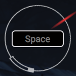
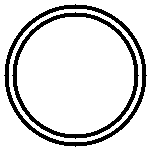
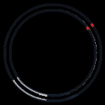
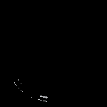
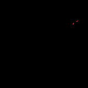
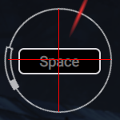

# Functionality
The following program automates the skill checks for https://www.mistersyms.com/tools/gitgud/. Skill checks are quick time events that require fast processing and precision.

**Disclaimer**:
Please note that this program will **not** run on the game Dead by Daylight. 

A skill check is broken down into several components:
* Red tick: Shows the current position of a skill check. When the space key is pressed, the tick's position relative to the other elements will determine the result.
* Great Skill Check: If a skill check ends in the tiny white box, extra points are rewarded, and the skill check is successful.
* Good Skill Check: If a skill check ends in the hollow bar, the skill check is successful.

The cost of a single failure is far greater than that of a great skill check; hence, the safest solution was selected. The following video shows the results of the skill check bot.

# How to Run
For web browsers, Chrome provides the best results. After [installing requirements.txt](https://stackoverflow.com/questions/7225900/how-can-i-install-packages-using-pip-according-to-the-requirements-txt-file-from), the code can be run off of "\_\_main\_\_.py". The program begins to run after an initial 5-second delay. Please have the appropriate web browser and tab selected. Otherwise, the program will be pressing the space key into the selected application. When ready to **stop the program**, press the q key. 

# How the program works

The problem of a skill check is greatly simplified by breaking it down to a unit circle.

    

By determining a relevant coordinate, a right triangle can be formed between the center and chosen coordinate.
Given that $tan(\theta) = opp/adj$, $\theta$ can be found by solving for $\theta = arctan(opp/adj)$.
Using trigonometry, the coordinates can be converted to degrees on a unit circle. The difference, in degrees between the skill check and red tick, is used to determine the wait time before completing a skill check.

## Image Detection

The image is initially filtered such that only pixels in the skill check remain. 
As a result, irrelevant pixels are far less likely to interfere with the problem.

    
    -
    
    =
    

Afterwards, the image is filtered for relevant pixels based on rgb values.

    
    
     
    Images are filtered separately according to red tick & the skill check portions.

From each of these images, a median coordinate is selected. The previous math is then applied to find the degrees of each element on the unit circle.

# Image capture & filter setup

In order to apply a unit circle to the skill check, verification is used to ensure the best coordinates for image capture. Additionally, the filter applied to the image needs to cleanly remove unnecessary portions of the image.

### Centering image capture

Under `detection.py`, the method findSpace takes the image used throughout the program: Current.png.
When `centeringCurrent.py` is run, cross.png is generated under resources/debug. The resulting image is used to determine if Current.png is centered. For additional adjustments, the coordinates used in `detection.py` need to be adjusted under the `findSpace` method.

    

### Creation of the filter

`filterCreation.py` offered a straightforward solution to developing a filter. When ran, a new ring.png is generated under resources/debug. The solution involves whiting out any pixels that are outside the exterior radius or inside the internal radius. The logic is applied once more in the reverse to create an additional ring on the inside.

    

### Filtering by colors

`mouseNow_Color.py` is used to determine the rgb values of a pixel on the screen. The rgb values filtered, under `filtering.py`, are then adjusted accordingly. Also, `filtering.py` can be run to quickly iterate over the values that are being filtered.